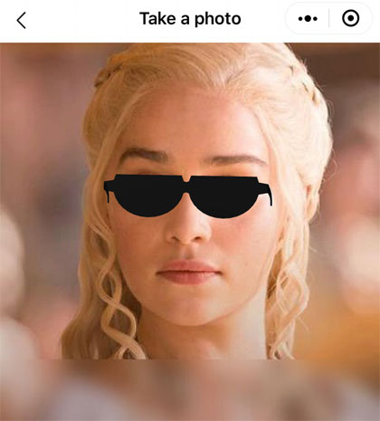
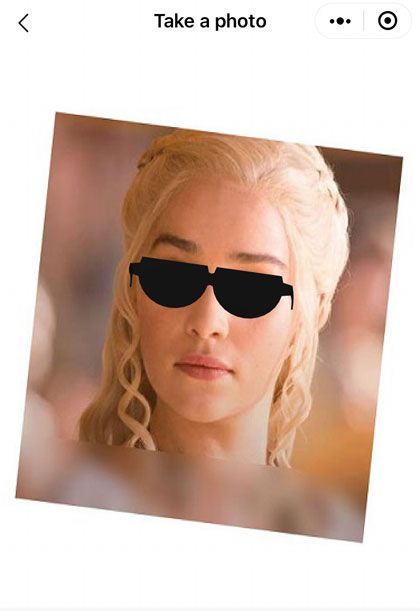
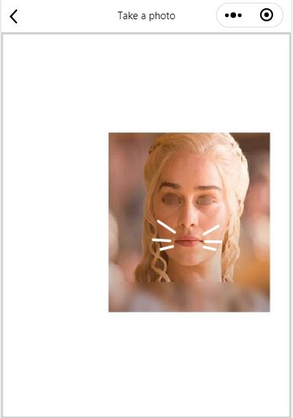
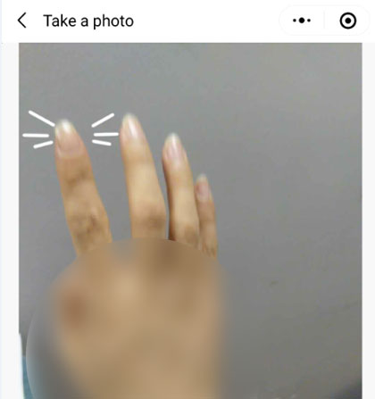
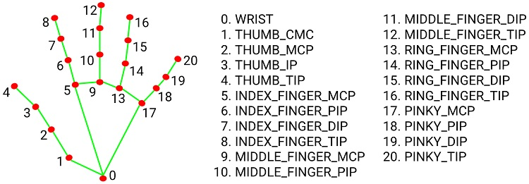

[Chinese README](https://zhuanlan.zhihu.com/p/81636351)  

## Updated

| Date　　　| Update |
| -- | -- |
| 2021-09-8 | New: Added a hand pose demo using tfjs, but it is slowly.|
| 2021-03-13 | Bug Fixed: 1. The image of the face 2d mask is not displayed on android WeChat. 2. When enter the demo UI on the second time, the 3D model is not displayed.|
| 2021-03-11 | New: A Face AR using "face-landmarks-detection" and "TensorFlow.js". Update: Replace "face-api.js" with "face-landmarks-detection", the codes of "face-api.js" are removed. |
| 2019-09-07 | New: A Face detecting and recognition with "face-api.js". |

## Introduction on WeChat Mini-program AR

TensorFlow.js is a JavaScript library for machine learning. 
There is a WeChat Mini-program plugin for TensorFlow.js.

[tfjs-wechat](https://github.com/tensorflow/tfjs-wechat)

We can create AR effects with TensorFlow.js. A "face-landmarks-detection" library is based on TensorFlow.js.

The "face-landmarks-detection" library offers a face detection in the browser environment. 

[face-landmarks-detection](https://github.com/tensorflow/tfjs-models/tree/master/face-landmarks-detection)

Why choose "face-landmarks-detection"?

Because I didn't find a tiny model of TensorFlow.js for face detecting until I found the "face-landmarks-detection" library.

This demo demonstrates a face AR. 

Index Page of the WeChat Mini-program


## Face Detecting and 3D Mask

Use the demo to scan a face. Expect a effect below.



A effect of translating and scaling.


A effect of rotating.



## Face Detecting and 2D Mask

Use the demo to scan a face. Expect a effect below.


A effect of translating and scaling.



A effect of rotating.


## Hand Pose and 2D Mask

Use the demo to scan a hand. Expect a effect below.



## How to build

The WeChat Mini-program includes some npm packages. We install and compile the npm packages.

step 1: run "npm install"

step 2: run "WeChat developer tool -- Tool Menu -- build npm", a folder "miniprogram_npm" will be created.

The project has included a "miniprogram_npm" folder precompiled.

File: /package.json

```javascript
  "dependencies": {
    "@tensorflow-models/face-landmarks-detection": "0.0.3",
    "@tensorflow-models/handpose": "0.0.6",
    "@tensorflow/tfjs-backend-webgl": "2.1.0",
    "@tensorflow/tfjs-converter": "2.1.0",
    "@tensorflow/tfjs-core": "2.1.0",
    "abab": "2.0.0",
    "base64-js": "1.3.1",
    "fetch-wechat": "0.0.3",
    "text-encoder": "0.0.4",
    "threejs-miniprogram": "0.0.2"
  }
```

## Set the url of the "TensorFlow.js" model

You can search a keyword "BLAZEFACE_MODEL_URL" in the "blazeface" folder. The search result is modified.

File: /miniprogram_npm/@tensorflow-models/blazeface

```javascript
// modified
var BLAZEFACE_MODEL_URL = 'https://m.sanyue.red/demo/tfjs/blazeface_v1';
```

You can search a keyword "FACEMESH_GRAPHMODEL_PATH" in the "face-landmarks-detection" folder. 

File: /miniprogram_npm/@tensorflow-models/face-landmarks-detection

```javascript
// modified
var FACEMESH_GRAPHMODEL_PATH = 'https://m.sanyue.red/demo/tfjs/facemesh_v1';
```

You can search keywords that are "HANDDETECT_MODEL_PATH" and "HANDPOSE_MODEL_PATH" in the "handpose" folder. 

File: /miniprogram_npm/@tensorflow-models/handpose

```javascript
// modified
HANDDETECT_MODEL_PATH = 'https://m.sanyue.red/demo/tfjs/handdetector_v1';

// modified
HANDPOSE_MODEL_PATH = 'https://m.sanyue.red/demo/tfjs/handskeleton_v1';
```

## Set the url of the 3D model

You may replace the default url of a gltf model for 3D mask.

File: /package_face_3d_mask/pages/photo/photo.js and /package_face_3d_mask/pagescamera/camera.js

```javascript
// a url of gltf model
const modelUrl = 'https://m.sanyue.red/demo/gltf/sunglass.glb';;
```

## Set the url of the 2D sprite image

You may replace the default url of a image for 2D mask.

File: /package_face_2d_mask/pages/photo/photo.js and /package_face_2d_mask/pages/camera/camera.js

```javascript
// a url of sprite image
const modelUrl = '../../utils/cat_beard.png';
```

## How to put a 3D model or a image on an other position

This is a map of the 486 keypoints of a face.

[486 keypoints Map](https://github.com/tensorflow/tfjs-models/raw/master/face-landmarks-detection/mesh_map.jpg)

For example, a number 168, number 122 and number 351 are the middle of the eyes.

File: /package_face_3d_mask/utils/modelBusiness.js

```javascript
// index of the track points of the face
const trackPointA = 168;
const trackPointB = 122;
const trackPointC = 351;
```
For example, a number 0, number 61 and number 291 are the mouth.

File: /package_face_2d_mask/utils/modelBusiness.js

```javascript
// index of the track points of the face
const trackPointA = 0;
const trackPointB = 61;
const trackPointC = 291;
```

## Hand Pose Map

The landmarks of the hand pose.



```javascript
    // the "predictions" is an array of objects describing each detected hand.
    [
      {
        handInViewConfidence: 1,
        boundingBox: {
          topLeft: [162.91, -17.42],
          bottomRight: [548.56, 368.23],
        },
        landmarks: [
          [472.52, 298.59, 0.00],
          [412.80, 315.64, -6.18],
          // etc.
        ],
        annotations: {
          thumb: [
            [412.80, 315.64, -6.18]
            [350.02, 298.38, -7.14],
            // etc.
          ],
          // etc.
        }
      }
    ]
```